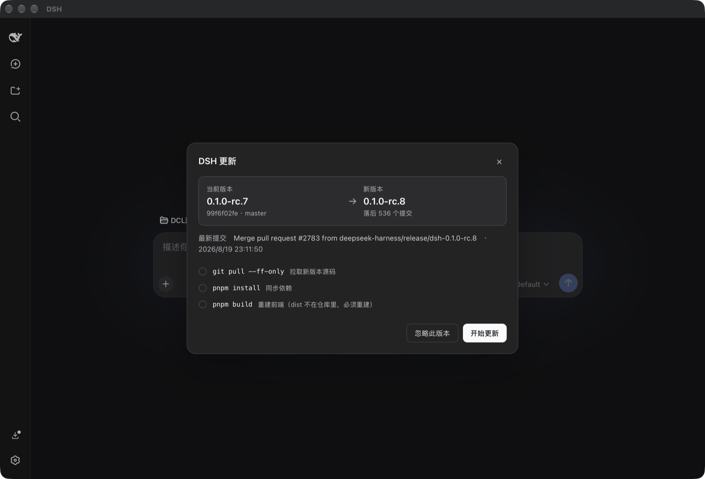

<div align="center">

# dsh-self-update

**English** | [简体中文](README.zh-CN.md)

In-app self-update for [DeepSeek Harness](https://github.com/deepseek-ai/deepseek-harness) git-source installs — with an optional native macOS shell.

[](https://www.npmjs.com/package/dsh-self-update)
[](LICENSE)
[](https://www.npmjs.com/package/@deepseek-ai/dsh)



</div>

## What is this?

If you run DeepSeek Harness **from a git checkout** (`git clone` + `pnpm dsh web`) — the way most self-hosted setups do — there is no built-in way to update it. Every release means manually running `git pull`, `pnpm install`, `pnpm build`, then restarting the service, and if anything breaks you dig out the old commit by hand.

**dsh-self-update turns that whole cycle into a button.** It is a harness plugin that:

- **checks quietly in the background** (every 6 h by default) and on demand, from the settings page or the macOS menu bar;
- shows a **"new version" entry in the sidebar** when there is something to install — clicking it opens an update panel with a version comparison and exactly the commands about to run;
- **installs in one click**: `git pull --ff-only` → `pnpm install` → `pnpm clean` → `pnpm build:official` (official branding build), with live per-step progress — the clean step drops stale gitignored build output that would otherwise poison a large version jump (skipped gracefully on harness versions without a `clean` script);
- **refuses to touch a dirty working tree** — it will never discard your local changes;
- **turns a diverged checkout into a guided exit** instead of a dead end: the panel lists your local-only commits and offers one-click **"back up & realign"** — your commits are saved to a `local-backup-<timestamp>` branch, the tree is hard-reset to the remote, and the update continues (refused while the tree is dirty);
- **rolls back in one click** if a step fails (and ships a CLI fallback for when the UI itself is down);
- **notices a stale running process**: it records the checkout's HEAD at startup, so once the code on disk moves ahead — its own install, your manual `git pull`, any other tool — the UI says **"Restart needed"** instead of quietly serving new frontend on top of an old host;
- **restarts the service** through a simple contract: the process exits with **code 75** for your supervisor (systemd, PM2, the bundled macOS shell) — and with **no supervisor at all** it respawns itself on macOS/Linux, so **Restart now** works even for a bare `pnpm dsh web` in a terminal.

**Not for you if** you installed dsh via `npm i -g @deepseek-ai/dsh`: there is no git working copy to update, so this plugin hides itself entirely. Use an npm-based updater such as `dsh-update-checker` instead.

## Install (any platform)

```bash
cd <your-deepseek-harness-checkout>
pnpm dsh plugin --profile web add dsh-self-update
```

Restart the dsh service once and you are done. No configuration needed — the plugin uses the process working directory as the harness checkout (override with the plugin config `repoRoot` if yours differs).

### Closing the restart loop

The **Restart now** button makes the process exit with **code 75** ("please restart me"). Teach your supervisor to honor it:

| Runner | Config |
|---|---|
| systemd | `RestartForceExitStatus=75` |
| PM2 | `autorestart: true` (the default) |
| macOS shell (below) | built in |
| bare terminal / no supervisor | built in (self-respawn on macOS/Linux; manual on Windows) |

When no supervisor is detected, the plugin spawns a detached `/bin/sh` helper that waits for the old pid to die (freeing the port) and then re-execs the identical node command line — a bare `pnpm dsh web`, or an orphaned process, restarts itself. On Windows there is no such path: the button reads **Stop service** and you run `pnpm dsh web` again by hand. The panel always states which of the three will happen.

Detection reads `DSH_SELF_UPDATE_SUPERVISOR` first, then systemd's `INVOCATION_ID`, then PM2's `pm_id`/`PM2_HOME`. **Set `DSH_SELF_UPDATE_SUPERVISOR` to any value (e.g. `custom`) when your supervisor already honors exit code 75** — otherwise the plugin self-respawns behind its back. `none`/`0`/`false` declare the opposite: nobody will restart me.

## macOS shell (optional)

A native Swift + WKWebView app (no Electron) that owns the dsh service: click the icon to open the UI, closing the window keeps the service running, ⌘Q stops it. It adds a **"Check for Updates…"** menu item that opens the in-app update panel, and it automatically relaunches the service when it exits with code 75 (and marks it `DSH_SELF_UPDATE_SUPERVISOR=macapp` so the plugin leaves the restart to the shell). A server it merely *adopted* — one already listening on the port that the shell did not start — is now watched too: if it goes away, the shell waits up to 45 s for it to come back on its own and otherwise starts and owns a fresh one. Works with the browser-auth introduced in harness 0.1.2: the shell picks up the tokened URL the server prints at startup, so the embedded page signs in by itself.

```bash
node macapp/build-mac-app.mjs        # requires Xcode command line tools
# outputs ~/Applications/DSH.app
```

First launch: right-click → Open (the app is ad-hoc signed, not notarized).

## How it compares

| | Updates | Platforms | Auto-restart |
|---|---|---|---|
| `dsh-update-checker` | npm packages | restart is Windows-only | ✅ (Win) |
| `dsh-update-copilot` | plugins; core is report-only | all | ❌ |
| **`dsh-self-update`** | **the harness git checkout itself** | **all (restart incl. macOS/Linux)** | **✅ (exit-code 75; no supervisor needed on macOS/Linux)** |

The exit-code-75 restart contract is the piece the community has been asking the harness core for (see upstream discussions [#1231](https://github.com/deepseek-ai/deepseek-harness/discussions/1231) and [#2717](https://github.com/deepseek-ai/deepseek-harness/discussions/2717)) — this plugin is a working implementation of it.

## Interface contract

- **HTTP** — `/self-update/api/update/{status,check,install,realign,rollback,restart}`. Write routes require `Content-Type: application/json` and a local `Origin` (CSRF line of defense).
- **Panel event** — dispatch `dsh-self-update:open` on `window` (`detail: { check: true }` to check immediately). This is exactly what the macOS menu item does via `evaluateJavaScript`.
- **Runtime** — `GET /update/status` carries `runtime: { pid, startedAt, sha, shortSha, stale, supervisor, restartMode }`. `stale` = the HEAD on disk is no longer the one this process booted from (the UI treats it exactly like "installed, restart pending"); `supervisor` is `macapp | systemd | pm2 | custom | none`; `restartMode` is `supervisor | self-respawn | manual`.
- **Restart** — `POST /update/restart` answers `{ ok, mode, exitCode }` and exits ~300 ms later; `mode` is the `restartMode` above. Exit code **75** means "restart requested" — anything else is a crash. The browser then polls status and reloads only once a *different* pid answers (up to 120 s).
- **State** — persisted at `~/.dsh-self-update/update-state.json`; the self-respawn helper's output at `~/.dsh-self-update/respawn.log`.

## When the UI is gone

If an update leaves dsh unable to boot (plugin/core seam breakage), the Web UI — rollback button included — is gone with it. Fall back to the CLI:

```bash
node scripts/rollback-harness.mjs          # target = previousSha from the state file
node scripts/rollback-harness.mjs --sha <commit>   # or pick a commit yourself
```

The updater records `previousSha` before every install precisely for this moment.

## Development

Sibling layout, same as the rest of the dsh plugin ecosystem: this repo must be checked out **next to** `deepseek-harness` — the `@deepseek-ai/*` dev dependencies are `link:../deepseek-harness/...`.

```bash
pnpm install
pnpm typecheck && pnpm test && pnpm build
```

The updater test suite runs against real (offline) git repositories; only the install/build commands are stubbed.

## License

[MIT](LICENSE)

---

[](https://github.com/deepseek-ai/deepseek-harness)
